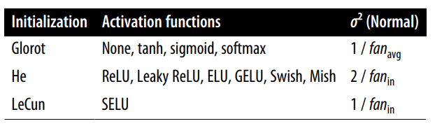

# Neural Networks Flowchart

**10/07/23 - Flowcharts will be completed and notes reorganised once I have compiled all initial notes.**

    A{Type of data?} --> B1[Numerical]
    A --> B2[Image]
    A --> B3[Sequential]

https://towardsdatascience.com/how-to-choose-the-right-activation-function-for-neural-networks-3941ff0e6f9c

## Hyperparameter Tuning

Paper on hyperparameter tuning best practices:  
https://arxiv.org/abs/1803.09820

**Number of hidden layers**  
Start with too many layers (overfit), then reduce.
* Simple problems: 1 or 2 layers  
* Complex problems: dozens (e.g. image classification), but use pretrained models.

**Number of neurons per hidden layer**  
Start with too many neurons (overfit), then reduce. ("Stretch pants" approach.)
* input and output determined by task (MNIST: 28x28 and 10)
* generally same #neurons for all hidden layers (only 1 hyperparameter)

**Learning rate**  
Arguably most important!  
* Optimal generally half of maximum (rate above which the training algorithm diverges - pg 167).  

One good approach:  
1.  train the model for a few hundred iter‐itions, starting with a very low learning rate (e.g., $10^{–5}$)
2. gradually increasing it up to a very large value (e.g., $10$). This is done by multiplying the learning rate by a constant factor at each iteration (e.g., by $(10 / 10^{-5})^{1 / 500}$ to go from $10^{–5}$ to $10$ in $500$ iterations).
3. plot the loss as a function of the learning rate (using a log scale for the learning rate), you should see it dropping at first. But after a while, the learning rate will be too large, so the loss will shoot back up: the optimal learning rate will be a bit lower than the point at which the loss starts to climb (typically about 10 times lower than the turning point).  
(See Chapter 11 for more)

**Optimizer**  
See Chapter 11.

**Batch size**  
Benefit of large batch sizes: GPUs can process them efficiently (algorithm sees more instances per second). However, often lead to training instabilities.  

One strategy:  
1. Use a large batch size (up to 8192) with learning rate warmup.
2. Try small batch size (between 2 and 32) if training is unstable or the final performance is disappointing.

## Vanishing/exploding gradients fixes
- activation function
- batch normalisation
- gradient clipping

**Activation function**  
* ReLU for all hidden layers for smaller tasks. (Remeber He initialisation.) Can try leaky ReLU to improve quality.
* Swish as default for more complex tasks
* SELU for deep MLPs (respect contraints, e.g. no regularisation, see pg 364 [392])
* output layer depends on task

**Number of iterations**  
Use early stopping.

**Batch normalization (BN)**  
* Add after activation - what the authors now do.
* Tweak `momentum` hyperparameter (default=0.99): typically close to 1 (0.9, 0.99, 0.999) - more 9's for larger datasets and for smaller mini-batches.
* Tweak `axis` hyperparameter (default=-1): see notes, less likely to need to change this.

**Gradient Clipping**
Clip the gradients during backpropagation so that they never exceed some threshold.
* Use for RNN (batch normalisation is tricky)

**Regularisation methods:**
* L1/L2
* Dropout
* Auxilary output (give it a low weight) - Read Hands-On page 362

**Shuffling the data**
gradient descent works best when the instances in the training set are independent and identically distributed (IID)

## Transfer Learning
* If the input pictures for your new task don’t have the same size as the ones used in the original task, you will usually have to add a preprocessing step to resize them to the size expected by the original model.

* The more similar the tasks are, the more layers you will want to reuse (starting with the lower layers). For very similar tasks, try to keep all the hidden layers and just replace the output layer.

1. Freeze all reaused layers and train model.
2. Unfreeze top 1-2 of top hidden layers and retrain.
3. If performance not good and have little trianing data, drop top hidden layer and repeat from 2.
4. If performance not good and have lots of training data, add a hidden layer.
(Compile model after you freeze or unfreeze layers.)

* The more training data you have, the more layers you can unfreeze.
* Reduce learning rate when unfreezing reused layers (to avoid wrecking their finetuned weights.)

* transfer learning does not work very well with small dense networks, presumably because small networks learn few patterns, and dense networks learn very specific patterns, which are unlikely to be useful in other tasks

* Transfer learning works best with deep convolutional neural networks, which tend to learn feature detectors that are much more general (especially in the lower layers).

**Unsupervised Pretraining**  
Good option when:
* complex task to solve
* no similar model you can reuse
* little labeled training data
* plenty of unlabeled training data

**Pretraining on an Auxiliary Task**
Good option when:
* complex task to solve
* no similar model you can reuse
* little training data
* lots of training data for an auxiliary task

## Faster Optimizers
Four ways to speed up training:
* apply a good initialisation strategy for the connection weights
* use a good activation function
* use batch normalisation
* reuse parts of a pretrained network (possible built for an auxiliary task)
* **use a faster optimizer than regular gradient descent optimizer**

Use Adam as default, then try NAG.

**Momentum**  
* `momentum=0.9` usually works well in practice

**Nesterov Accelerated Gradient**  

**AdaGrad**  
Swerve

**RMSProp**
* `rho=0.9` usually works well in practice

**Adam**  
*adaptive moment estimation*
* `learning_rate=0.001, beta_1=0.9, beta_2=0.999`

**AdaMax**

**Nadam**

**AdamW**

## Learning Rate Scheduling

After training, `history.history["lr"]` gives you access to the list of learning rates used during training.

Need to manually implement most learning rate schedulers, but it's very easy. See pg 418.

Try exponential decay, performance scheduling, and 1cycle.

## Regularization

**l1 and l2 Regularization**  
Use l1 for a sparse model.

Apply the same to all layers.

**Dropout**  
Since dropout is only active during training, comparing the train‐ing loss and the validation loss can be misleading. In particular, a model may be overfitting the training set and yet have similar training and validation losses. So, make sure to evaluate the train‐ing loss without dropout (e.g., after training).

If model overfitting, increase dropout rate.  
If model underfitting, decrease dropout rate.

If you want to regularize a self-normalizing network based on the SELU activation function (as discussed earlier), you should use alpha dropout.

Yes, dropout does slow down training, in general roughly by a factor of two. However, it has no impact on inference speed since it is only turned on during training. MC Dropout is exactly like dropout during training, but it is still active during inference, so each inference is slowed down slightly. More importantly, when using MC Dropout you generally want to run inference 10 times or more to get better predictions. This means that making predictions is slowed down by a factor of 10 or more.

**Monte Carlo (MC) Dropout**
Always apply MC dropout when wanting to use dropout.

If you only care about the functional API or the subclassing API, you do not have to create an MCDropout class; you can create a regular Dropout layer and call it with `training=True`.

**Max-Norm Regularization**  
ℓ1 and ℓ2 regularization discourage the use of large weights, whereas max-norm regularization prevents the magnitude of any weight from exceeding a given threshold value.

If you want to use max-norm with convolutional layers make sure to set the max_norm() constraint’s axis argument appropriately (usually axis=[0, 1, 2]).

## Summary and Practical Guidelines
|                          |                          |
|--------------------------|--------------------------|
|  |  |

1. If the network is a simple stack of dense layers, then it can self-normalize, and you should use the configuration in Table 11-4.
2. Don’t forget to normalize the input features!
3. You should also try to reuse parts of a pretrained neural network if you can find one that solves a similar problem, or
4. Use unsupervised pretraining if you have a lot of unlabeled data, or 
5. Use pretraining on an auxiliary task if you have a lot of labeled data for a similar task.

**Exceptions to guidlines**

* If you need a sparse model, you can use ℓ1 regularization (and optionally zero out
the tiny weights after training). If you need an even sparser model, you can use the TensorFlow Model Optimization Toolkit. This will break self-normalization, so you should use the default configuration in this case.

* If you need a low-latency model (one that performs lightning-fast predictions), you may need to use fewer layers, use a fast activation function such as ReLU or leaky ReLU, and fold the batch normalization layers into the previous layers after training. Having a sparse model will also help. Finally, you may want to reduce the float precision from 32 bits to 16 or even 8 bits (see “Deploying a Model to a Mobile or Embedded Device” on page 741). Again, check out TF-MOT.

• If you are building a risk-sensitive application, or inference latency is not very important in your application, you can use MC dropout to boost performance and get more reliable probability estimates, along with uncertainty estimates.

## Other
Use this to write cleaner code!
`from functools import partial` 

Complete last exercise of chapter 11.

## Chapter 12

When you create a tensor from a NumPy array, make sure to set  `dtype=tf.float32`. (By default, NumPy uses float64.)

## RNN Notes
* Make time series more stationary to improve performance, e.g. using differencing.
* using a single model for multiple related tasks often results in better performance than using a separate model for each task, since features learned for one task may be useful for the other tasks, and also because having to perform well across multiple tasks prevents the model from overfitting (it’s a form of regularization). However it depends on the task. Sometimes dedicated models can perform better.